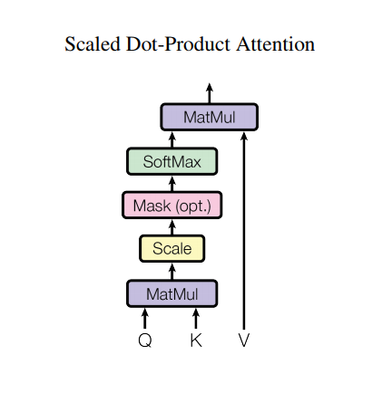

# English-Hindi-Translation-using-Transformer

Machine translation using Transformers
Dataset used IIT Bombay English-Hindi Corpus 

## Transformer

### Attention

## References

<https://www.tensorflow.org/tutorials/text/transformer>

 [The IIT Bombay English-Hindi Parallel Corpus](https://arxiv.org/abs/1706.03762)

Anoop Kunchukuttan, Pratik Mehta, Pushpak Bhattacharyya. [The IIT Bombay English-Hindi Parallel Corpus]. Language Resources and Evaluation Conference. 2018.

[The IIT Bombay English-Hindi Parallel Corpus] : http://www.cfilt.iitb.ac.in/iitb_parallel/lrec2018_iitbparallel.pdf
